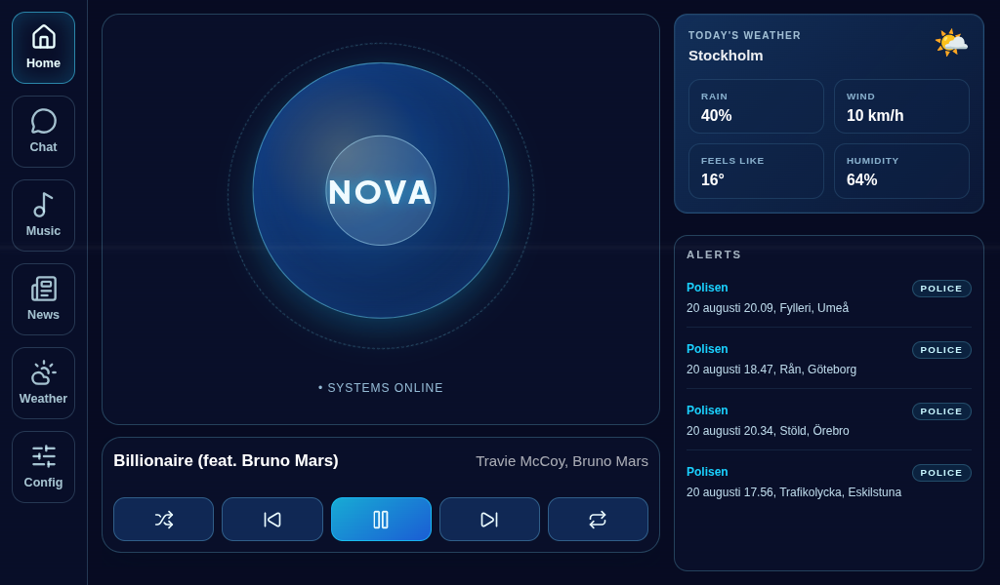
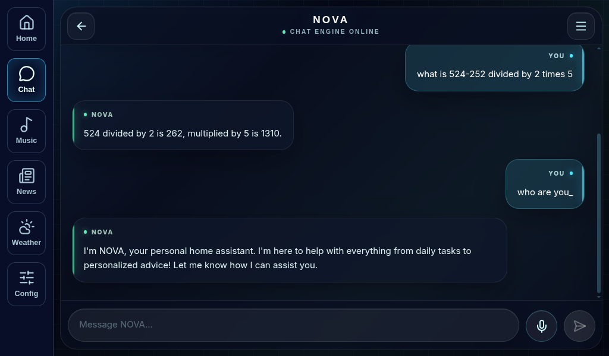
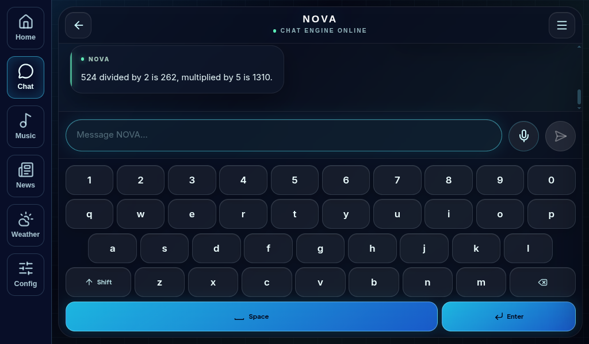
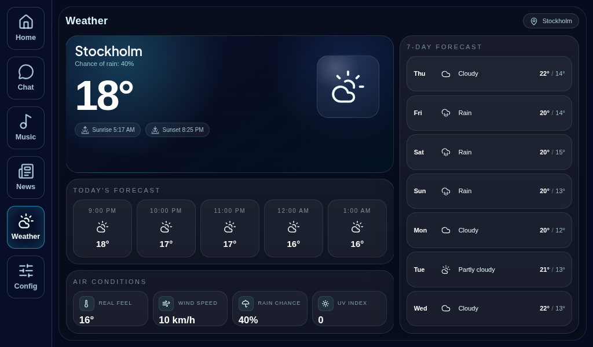

# NOVA

NOVA is a local first home dashboard, voice assistant, and automation system for Raspberry Pi 5 and other small computers. It is designed to live on a touchscreen in the home: one place to talk to a local AI, control music, check weather, follow public alerts, manage scheduled tasks, and configure the device.

The project combines an Electron and React desktop interface with a Python and FastAPI backend. Core chat, routing, speech recognition, and text to speech run locally where possible, while optional integrations add Spotify playback, Telegram notifications, weather data, and web search.

> Desktop application version: **1.4.0**. NOVA is currently in beta.

## What NOVA Is



| Area | What it does |
| --- | --- |
| Home dashboard | Shows live assistant state, music playback, weather, system status, and a public alert ticker. |
| Voice and chat | Supports touchscreen chat, push-to-talk transcription, lightweight live listening, wake-word support, and spoken answers. |
| Music | Controls Spotify playback, devices, playlists, queue actions, repeat, shuffle, and volume from a dedicated music view. |
| Weather and alerts | Provides a weather view plus a regional public alert feed in the News view. |
| Tasks and automation | Runs scheduled assistant tasks and offers local controls for the screen and audio source. |
| Settings | Lets the user control visual preferences, voice behavior, alert regions, audio source, Telegram notifications, and shutdown. |
| Notifications | Delivers optional startup and public-alert notifications through Telegram. |

## Install NOVA

### Recommended: Raspberry Pi or Ubuntu Linux

NOVA includes an installer at [`install.ps1`](install.ps1). NOVA is supported on Linux-based distributions only, with Raspberry Pi OS and Ubuntu as the primary targets. The PowerShell installer adds system packages, Python 3.11, Node.js 22, backend and frontend dependencies, Electron sandbox permissions, and the Vosk speech model.

The script uses `sudo`, needs an internet connection, and deliberately recreates `.venv`. Stop any running NOVA backend before running it.

```bash
git clone https://github.com/ZydroHub/NOVA.git
cd NOVA
pwsh ./install.ps1
```

After installation, configure optional credentials in `.env` and start NOVA in two terminals:

```bash
# Terminal 1: backend
source .venv/bin/activate
python app.py
```

```bash
# Terminal 2: Electron dashboard
cd chat-gui
DISPLAY=:0 npm run dev
```

The backend listens on `http://127.0.0.1:8000` by default. On a Raspberry Pi desktop session, `DISPLAY=:0` opens NOVA on the connected screen.

### Manual Linux setup

Use manual setup when you want to manage the runtime versions yourself. Raspberry Pi OS and Ubuntu are the primary deployment targets.

```bash
# From the repository root on Linux
python -m venv .venv
source .venv/bin/activate
python -m pip install --upgrade pip
python -m pip install -r requirements.txt
cp .env.example .env

cd chat-gui
npm ci
```

## What Runs Inside NOVA

### AI and voice pipeline



```text
Touch, microphone, scheduled task, or dashboard action
                         |
                         v
              Electron + React dashboard
                         |
                         v
       FastAPI HTTP API and authenticated WebSockets
                         |
                         v
       Conversation, routing, tools, and task scheduler
            |                    |                 |
            v                    v                 v
      Qwen local chat      FunctionGemma      Spotify, alerts,
      via llama.cpp        tool selection     weather, Telegram
            |
            v
      Piper spoken response
```

| Component | Role | Version or model |
| --- | --- | --- |
| Desktop shell | Electron | 40.4.0 |
| Dashboard | React | 19.2.0 |
| Frontend tooling | Electron Vite / Vite | 5.0.0 / 7.3.1 |
| API and WebSockets | FastAPI / Uvicorn | 0.129.2 / 0.41.0 |
| Local LLM runtime | llama-cpp-python | 0.3.16 |
| Chat model | Qwen3 0.6B Q8 GGUF | Local model downloaded on demand |
| Tool model | FunctionGemma Q4 GGUF | Local model downloaded on demand |
| Speech-to-text | faster-whisper | 1.2.1 for accurate push-to-talk transcription |
| Live listening | Vosk | 0.3.45, including wake-word support |
| Text-to-speech | Piper | 1.4.1, streamed spoken replies |
| Scheduling | APScheduler | 3.10.4 |
| Data validation | Pydantic | 2.12.5 |

An optional semantic router chooses between the general local chat path and the tool path. If it is not installed, NOVA falls back to normal chat. `requirements.txt` pins the backend packages; `chat-gui/package-lock.json` pins the frontend dependency tree.



### Integrations and local services

- **Spotify:** playback, playlists, devices, repeat, shuffle, and Spotify Connect helper scripts.
- **Weather:** weather data for the dashboard and dedicated Weather view.
- **News and alerts:** public alert data with selectable regional alert settings.
- **Telegram:** optional test, startup, and alert notifications.
- **Web search:** an assistant tool for online lookups when the feature is enabled.
- **System controls:** local screen, audio-source, health, and system-statistics controls.



## Architecture

```text
chat-gui/                 Electron main process + React interface
  Home, Chat, Music,
  News, Weather, Settings
             |
             | HTTP + WebSocket on localhost
             v
app.py                    FastAPI application and integration endpoints
chat_ai.py                Conversations, chat/voice WebSockets, audio pipeline
semantic_router_ai.py     Optional request routing
tool_ai.py                Local assistant tools and integrations
task_scheduler.py         Persistent scheduled tasks
tts_piper.py              Piper speech output
stt_whisper.py            Whisper transcription
stt_vosk.py               Live Vosk recognition and wake word
telegram_bot.py           Telegram notifications
```

## Configure NOVA

Create `.env` from [`.env.example`](.env.example). The file is ignored by git and must stay private.

```env
# Local backend
PORT=8000
NOVA_BIND_HOST=127.0.0.1

# Optional Spotify integration
SPOTIFY_CLIENT_ID=
SPOTIFY_CLIENT_SECRET=

# Optional Telegram notifications
TELEGRAM_BOT_TOKEN=

# Voice defaults
WHISPER_LANGUAGE=en
NOVA_AUDIO_SOURCE=spotify
```

For Spotify, create an application in the Spotify Developer Dashboard and use `http://127.0.0.1:8000/callback` as the redirect URI. Add its credentials to `.env`, restart NOVA, then complete the login flow from NOVA.

## NOVA Soul

`soul.md` is NOVA's local shared personality and durable memory context for both chat and voice. It is created automatically from [`soul.template.md`](soul.template.md) and ignored by git so NOVA can append memories without causing pull or commit conflicts.

The manual sections define NOVA's core identity and behavior, while `## Auto Memory` is reserved for short append-only memories that NOVA can add after completed conversations. The backend reloads local `soul.md` automatically when it changes. `GET /system/soul-status` returns debug metadata such as parse status and memory count without exposing the soul content.

## Raspberry Pi Notes

NOVA is designed around Raspberry Pi 5 with 8 GB RAM, a touchscreen, microphone, and speaker. The model files take several gigabytes of storage, and local LLM response speed will depend on the model, RAM, cooling, and storage performance.

The repository also includes Linux helper scripts:

- [`scripts/start-nova.sh`](scripts/start-nova.sh) starts the backend and Electron app on Linux.
- [`Makefile`](Makefile) contains optional Spotify Connect setup and removal targets through Raspotify.
- [`scripts/manual/README.md`](scripts/manual/README.md) lists opt-in hardware, audio, model, and Ollama smoke checks.

## Test, Lint, and Build

Run the deterministic backend test suite from the repository root:

```bash
python -m pytest
```

Run frontend checks from `chat-gui`:

```bash
npm run lint
npm run build
```

Manual audio and model checks require real hardware and downloaded models, so they intentionally live outside the regular pytest suite.

## Portfolio Media

The README includes sanitized screenshots of the Home dashboard, chat flow, keyboard input, and Weather view. Suggested names for additional portfolio media live in [`docs/media/README.md`](docs/media/README.md).

Never include chat history, Telegram identifiers, Spotify credentials, local IP addresses, network scan output, or private household information in portfolio media.

## Before Your First GitHub Push

```bash
git status --short
git diff --check
python -m pytest
```

Confirm that `.env`, `models/`, local conversations, databases, logs, build output, and runtime data are not staged. Start the public repository with a fresh `git init` rather than carrying over a private git history.

## Security and Privacy

NOVA is intended for a trusted local device, not as a public web service.

- The backend binds to `127.0.0.1` by default.
- State-changing requests and WebSocket connections use a per-process control token.
- The token endpoint accepts loopback clients only.
- `.gitignore` excludes secrets, models, conversations, databases, logs, build output, and other local runtime data.
- Do not expose the backend directly to the internet. Use a separate, authenticated reverse proxy if remote access is ever needed.

## License

NOVA is licensed under [Creative Commons Attribution-NonCommercial 4.0 International](https://creativecommons.org/licenses/by-nc/4.0/). You may share and adapt the project with attribution for non-commercial purposes.
